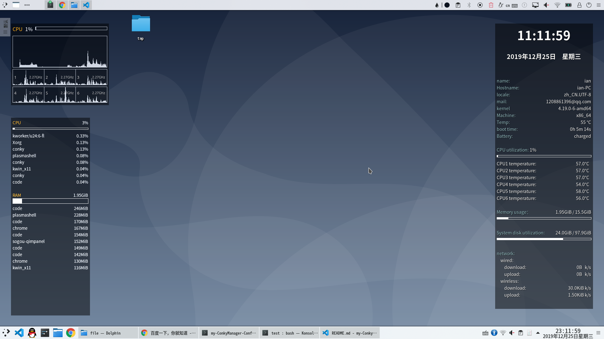

# conky manager配置文件

ps:2019.12.25 更新(~~没有女朋友圣诞节一个人过~~)

***

### 简要介绍

> Conky Manager is a graphical front-end for managing Conky config files. It provides options to start/stop, browse and edit Conky themes installed on the system. Packages are currently available in Launchpad for Ubuntu and derivatives (Linux Mint, etc).

以上来自官网


个人在不同的Debian系发行版桌面环境下均尝试过conky-manager, 包括

+ Ubuntu18.04的GNOME与uity桌面
+ deepin15.9及以上的自研dde桌面
+ Debian10.1.0的kde与xfce桌面
  
均有尝试, 无明显bug, ~~不过似乎部分steam游戏下在运行时conky不透明度蛇者会失效~~...
(不知道原理求大佬解答...)


ps: 这个配置文件我是基本上照着网上别人的配置直接改的...
很简陋...

### 安装教程
[官网地址](https://teejeetech.in/conky-manager/)
[官方github项目地址](https://github.com/teejee2008/conky-manager)

##### 1. ppa源安装
``` shell
sudo apt-add-repository -y ppa:teejee2008/ppa
sudo apt-get update
sudo apt-get install conky-manager
```

##### deb包安装
```shell
wget https://launchpad.net/~teejee2008/+archive/ubuntu/ppa/+files/conky-manager_2.4~136~ubuntu16.04.1_amd64.deb
sudo apt install gdebi -y
sudo gdebi conky-manager*.deb
```

效果图
